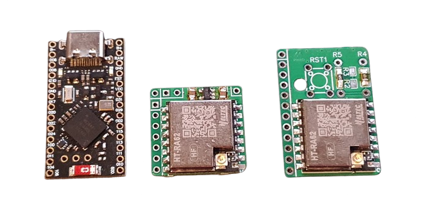

# NiceRa
My DIY boards.

## Disclaimer
These boards have not been tested under every circumstance and may have bugs. Manufacture at your own risk!

## Notes
[Standard pinout for Pro-Micro board](./Pro-micro_std_pinout.md)

[Lora modules & dimensions](./Lora_Modules.md)

[GPS power consumption measurements](./GPS_power_consumption.md)

## Useful links:

### [The vaRDas unofficial firmware flasher](https://mrekin.duckdns.org/flasher/)
vaRDas is kind enough to maintain a flasher with the latest releases of the firmware.

### [Adafruit bootloader updates](https://github.com/adafruit/Adafruit_nRF52_Bootloader/releases)
Find update-nice_nano_bootloader-0.9.x, and copy the uf2 across to your pro-micro.

### [Nice!Nano starting guide](https://nicekeyboards.com/docs/nice-nano/getting-started/)
Some useful information on the board that the Pro-Micro is "inspired by".

### [Haruki Toreda stuff](https://harukitoreda.github.io/Meshtastic-Experiments/)

## Other peoples boards:
### Fake-tec - NRF52840
https://github.com/gargomoma/fakeTec_pcb/
* Uses the same NRF52840 Pro-micro boards as my designs above
* An excellent design, using the outline of the Heltec v3 to take advantage of all the cases out there.
* Has a voltage divider built-in, with thru-hole or SMD resistors
* Can flush-mount the PCB to reduce height even further

### Cheapmesh - ESP32-C3
https://gitlab.com/paulhausk/CheapMesh/-/tree/main
* HT-CT62 based
* Multiple options to power & interface
* Initial issue has native USB d+/d- switched - check before building
* Has components on the underside that make it harder to assemble

### Econotastic - RP2040
https://sites.google.com/view/econotastic/home
* RP Pico (or clone) as MCU
* Uses RA-01SH, but can also use HT-RA62
* Changes in code not really required - see `TCXO_OPTIONAL`

### Mesh Heltec Tiny - ESP32-C3
https://oshwlab.com/vardas/meshheltectiny
* HT-CT62 based
* Pretty complete

### Ikoka nano
https://github.com/ndoo/ikoka-nano-meshtastic-device
* Uses NRF52 based Xiao board
* Uses a 30db radio module, 1W of power in a very small package

### Original Xiao BLE node
https://github.com/meshtastic/firmware/blob/master/variants/xiao_ble/README.md
* Uses NRF52 based Xiao board
* Shows the basic pinout and procedures for making the basic node.
* The original!
