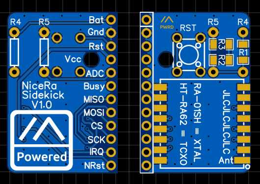
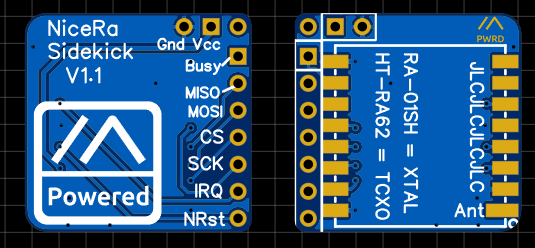

## Sidekick Breakout V1.0 and V1.1

### V1.0 Full-size board
This has 3 options for adding battery voltage sense resistors:
1) two thru-hole resistors (ratio 2:3, e.g. 220k & 330k)
2) three 1206 size SMD resistors (e.g. 1M, 500k & 1M)
3) two 1206 size SMD resistors (e.g. 750k & 500k)

### V1.1 Small board
This has no sense resistors, and the GND and VCC wires must be wired in using jump wires from the main board.

