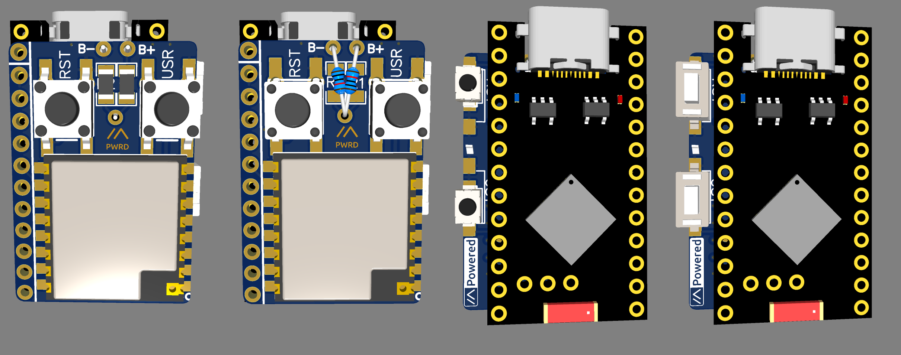

## Sidekick Breakout V2.0

### V2.0 Full-size board
This has 3 options for adding battery voltage sense resistors:
1) two thru-hole resistors (ratio 2:3, e.g. 220k & 330k)
2) two 1206 size SMD resistors (e.g. 750k & 500k)
Secret hidden option 3) two 0805 resistors on the same footprint as the 1205

This has 4 options for Reset and User buttons:
1) 2x 6x6mm SMD tactile switches on the radio module side
2) 2x 6x6mm thru-hole switches with two legs cut off on the radio module side
3) 2x 3.5x6mm SMD tactile switches on the Pro-Micro side
4) 2x 3x4mm SMD tactile switches on the Pro-Micro side

Secret hidden option 5) A 4.5x4.5mm thru-hole tactile switch can be placed between pins 23 & 24 (i.e. RST and GND) on the radio module side.

### How to order
1) Take the zip folder with the Gerber files in
2) Upload it to the PCB fabricator of your choice (I've put placeholder text for JLCPCB order numbers on the board, but this is covered by the radio module once assembled. Note that you have to select the option to place the order number there, otherwise they'll add it where it suits them!)
3) Select surface finish, PCB thickness, and other options
4) I've tested these boards at 1.0mm thickness, and they work ok. Thicker is better, but obviously translates directly into node size

### How to assemble
As before, you will need:
* 1x NRF5280 Pro-micro - a Nice!Nano clone that is available on AliExpress[^1] for ~$3 plus shipping
* 1x HT-RA62 **or** RA-01SH module
* 2x Resistors (see options above)
* 2x Tactile switches (see options above)

1) Solder the boost pads together on the Pro-micro, if you want to charge faster than 100mA
2) Solder the resistors on to the PCB - these are the most heat resistant parts
3) Solder the RA module to the PCB
4) Solder the switches in the locations that suit you. Use the Pro-micro as a guide if placing 3.5x6mm switches on the back-side.
5) Solder the PCB back-to-back to the Pro-micro. You can either just align the holes and fill with solder, or place pin-headers through both holes and solder more conventionally. If you choose to do the latter, you can cut the pins right down after soldering for a really small format.
6) Solder the User Button pin - this is tricky to do, but as long as the pad is visble throught the hole on the Pro-micro you should be able to get a decent electrical connection. Additonal flux paste on the pad will help with solder wetting and adhesion.
7) [Update the bootloader](https://github.com/adafruit/Adafruit_nRF52_Bootloader/releases). The Nice!Nano update version is compatible.
8) Flash the latest Meshtastic firmware to the device from [this extremely helpful site](https://mrekin.duckdns.org/flasher/). **Note that `nrf52_promicro_diy_tcxo` is compatible with both types of radio module above.**

[^1]: Other online tat merchants are available.
